# Metronome-First Managed Provider Billing Foundation

**Status:** Approved design  
**Linear owner:** [MYAH-149 — Implement managed provider billing foundation](https://linear.app/t3labs/issue/MYAH-149/implement-managed-provider-billing-foundation)  
**Project / milestone:** myah / Beta.1 — Commercial foundation, payment, provisioning, and trust  
**Canonical branch:** `daryll/myah-149-implement-managed-provider-billing-foundation`

## 1. Decision summary

Metronome will be Myah's prepaid USD billing system of record.

Metronome owns:

- prepaid USD commitments and their remaining balances;
- products, billable metrics, contracts, and rate cards;
- Stripe-funded balance release, automatic recharge, invoices, dashboards, and billing alerts;
- accepted customer usage and the resulting USD-balance drawdown.

Myah will not build a competing customer wallet, balance ledger, pricing engine, Stripe synchronization layer, invoice system, or billing dashboard.

Myah adopts a fixed reviewed-price policy for managed provider services. Each later provider-specific integration records the provider's published USD cost per billing unit and configures the corresponding Metronome USD-cent rate so that the customer price provides at least a 30% gross margin. Myah does not fetch or recalculate live upstream prices during a customer request.

Myah still has one responsibility that Metronome cannot perform: Myah physically starts external provider work. Before a future OpenRouter or Icemail adapter begins that work, Myah must prevent simultaneous requests from claiming the same remaining prepaid USD balance. Myah must also remember a completed provider operation until its usage reaches Metronome.

MYAH-149 therefore adds one small, durable provider-operation journal. Each row is a temporary USD-cent reservation, provider receipt, and pending Metronome-delivery record for one operation. It is not a second customer balance.

OpenRouter execution, OpenRouter service-price entries, and Icemail mailbox/provider lifecycle and pricing are explicitly out of scope. They are later consumers of this foundation.

## 2. Problem explained plainly

Suppose a workspace has a $1.00 prepaid balance and starts two provider calls at the same time. Each call could independently read "$1.00 available" and each could authorize an $0.80 customer charge. Metronome can correctly bill both completed calls, but Myah has already authorized $1.60 against only $1.00 of prepaid funds.

Metronome's zero-overage guidance explicitly says that application-side gating is still required. Its public API can:

- return a customer's current prepaid USD balance;
- preview how usage would be priced;
- accept repeat-safe usage events;
- draw down prepaid commitments according to the contract.

Its public API does not expose a conditional debit, reservation, or hold that atomically locks part of a customer's balance before an external provider call.

Myah must therefore keep the smallest possible local claim against the balance while provider work is active. That claim must survive concurrent requests and process crashes, but it must not reproduce Metronome's financial model.

## 3. System boundary

```mermaid
flowchart LR
  A[Future OpenRouter or Icemail adapter] --> B[Metronome USD price preview]
  B --> C[Metronome prepaid USD balance read]
  C --> D[Myah temporary USD-cent reservation]
  D --> E[External provider operation]
  E --> F[Myah durable provider receipt]
  F --> G[Repeat-safe Metronome usage delivery]
  G --> H[Metronome prices usage and draws down prepaid USD]
  H --> I[Myah confirms balance settlement, then releases reservation]
```



There is no database transaction spanning Myah, Metronome, and a provider. The design is instead recoverable at every boundary:

1. Myah saves a reservation before provider work begins.
2. Myah saves the provider outcome before returning success to the caller.
3. Myah retries Metronome delivery with the same transaction ID.
4. An unknown provider outcome retains its reservation and requires reconciliation; it is never blindly retried or silently released.

## 4. Community and licensing boundary

The implementation must not import, inject, query, configure, or depend on anything beneath:

```text
packages/twenty-server/src/engine/core-modules/billing/**
packages/twenty-server/src/engine/metadata-modules/ai/ai-billing/**
```

Those paths contain TwentyCRM Enterprise billing functionality. MYAH-149 is a separate Community-safe Myah module and must work without an Enterprise key.

### 4.1 Public-source decision

MYAH-149 is intentionally implemented in this public repository. The Community-safe module, its reservation/receipt lifecycle, Metronome integration contract, fixed reviewed-price policy, and later provider-specific price mappings may be visible in source. This is not a privacy boundary.

Actual API keys, payment records, customer balances, provider credentials, and deployment-specific Metronome or Stripe identifiers remain private through environment configuration and the external providers' control planes. No source path, feature flag, or license comment is used to represent private Myah code.

The implementation may reuse Community-safe platform infrastructure:

- `TwentyConfigService`;
- core TypeORM entities and repositories;
- `MessageQueueService`;
- the existing `MyahWorkspaceInstallationEntity`;
- standard upgrade commands;
- logging, metrics, and exception reporting.

`IS_BILLING_ENABLED`, Twenty Enterprise resource credits, Enterprise Stripe services, and Enterprise billing modules are not feature flags or dependencies for this work.

## 5. Scope

### 5.1 Included

1. Server-only Metronome configuration and the official typed Node SDK behind one small Nest service.
2. Recoverable mapping from one Myah workspace to one Metronome customer.
3. Creation or verification of the workspace's Metronome customer contract against a configured USD rate-card alias.
4. Metronome price preview and strict-prepaid balance reads in the built-in USD-cents unit.
5. A fixed reviewed-price policy requiring at least 30% gross margin for every later managed provider service.
6. One database table representing the provider-operation reservation, receipt, and usage-delivery lifecycle.
7. Concurrency-safe reservation under a database row lock.
8. Exact replay handling and conflict detection for the same Myah request.
9. Durable, repeat-safe usage delivery using the operation's deterministic Metronome transaction ID.
10. Queue retry plus a small recovery scan for database rows that remain pending.
11. Explicit handling of known provider failure, unknown provider outcome, stale reservation, and over-reservation pricing.
12. Sandbox contract verification of undocumented or timing-sensitive Metronome behavior.
13. Migration, service, concurrency, job, recovery, and Community-boundary tests.

### 5.2 Excluded

- OpenRouter API calls, keys, model selection, service catalog entries, text generation, retries, or runtime routes;
- Icemail domains, mailboxes, credentials, service catalog entries, provisioning, lifecycle, or charges;
- customer-facing or Myah-team billing UI;
- provider-account lifecycle or provider-secret storage;
- a Myah customer balance, top-up, refund, invoice, subscription, or database pricing table;
- Myah-owned Stripe checkout or payment webhooks;
- promotional credits or postpaid customer spending in the first rollout;
- tax, disputes, chargebacks, and revenue recognition;
- dynamic provider-price lookup or a generic pricing/provider SDK framework;
- automated correction of a disputed or over-reservation usage event before Metronome correction semantics are proven.

## 6. Metronome account and pricing model

### 6.1 Workspace mapping

One Myah workspace maps to one Metronome customer.

The Metronome ingest alias is deterministic:

```text
myah-workspace:<workspaceId>
```

`MyahWorkspaceInstallationEntity` stores the resulting nullable `metronomeCustomerId`. The Metronome API supports exact lookup by ingest alias, which makes provisioning recoverable:

1. Return the stored customer ID when present.
2. Otherwise search Metronome by the deterministic alias.
3. Reuse the matching customer when found.
4. Create the customer when absent.
5. If creation races or returns an uncertain result, search by the same alias and reuse the winner.
6. Persist the ID using a conflict-aware database update.

Customer creation and contract creation are separate operations. The composite create-customer-with-contract endpoint is not used because its availability depends on client configuration. Contract creation uses a deterministic Metronome uniqueness key and the configured rate-card alias. The observed replay behavior is `409 Conflict` without the winning contract ID, so recovery uses `/v2/contracts/list` for the customer and verifies exactly one current contract with the expected rate card. The legacy v1 list endpoint is disabled.

### 6.2 Strict prepaid USD balance

The production contract uses Metronome's built-in USD-cents pricing unit. Customer-facing balances and charges are ordinary dollars; Myah stores and compares their integer cent representation.

The net-balance request:

- omits `credit_type_id`, which the official Metronome contract defines as defaulting to USD cents;
- requests `invoice_inclusion_mode: "FINALIZED_AND_DRAFT"`;
- filters to `balance_types: ["PREPAID_COMMIT"]`.

This deliberately excludes postpaid commitments and promotional credits from eligibility for managed provider execution. The returned balance and every previewed usage-line amount must be a finite, non-negative safe integer before conversion to local `bigint`. Fractional cents, non-finite values, negative values, or an unexpected unit fail closed.

### 6.3 Fixed service pricing and 30% gross margin

Every later provider integration owns a small reviewed service-catalog entry beside that adapter. The entry identifies:

- the stable service key and Metronome event/product mapping;
- the provider's published USD cost per chosen billing unit, represented as integer micro-USD;
- the expected customer unit price in integer USD cents;
- the source and review date for the provider price.

For a provider cost expressed in either USD or integer micro-USD, the fixed customer price is:

```text
customerPriceCents = ceil(providerCostUSD / 0.70 * 100)
                   = ceil(providerCostMicrousd / 7000)
```

For example, a provider billing unit costing $10.00 becomes a customer price of $14.29. Rounding is always upward to the nearest cent, so the realized gross margin is never below 30%. Later provider integrations must choose billing units large enough that cent rounding remains commercially sensible.

The same reviewed price is configured in the Metronome USD rate card. A provider service cannot be enabled until a contract test previews one billing unit and proves that the matching Metronome usage-line price equals the catalog's expected customer price. When an upstream provider changes price, the service remains on the old reviewed version or is disabled until both the catalog entry and a newly effective Metronome rate are reviewed and verified.

MYAH-149 does not create an empty generic catalog, provider-specific entries, or a runtime pricing engine. Those entries belong to the later OpenRouter and Icemail integration issues, where their real upstream costs and billable units are known.

### 6.4 Metronome owns runtime pricing

A future provider adapter does not pass an arbitrary customer price to Myah's billing foundation. It passes:

- a reviewed service identity and its expected Metronome event/product mapping;
- a safe, bounded worst-case usage event;
- after completion, the actual safe usage event.

Myah calls Metronome's customer preview endpoint with `mode: "replace"`. Metronome applies the active USD rate card and returns draft invoices with usage line items before prepaid-balance application.

The reservation is the losslessly validated sum of all expected `type: "usage"` line-item totals in USD cents. It is **not** `invoice.total`: the sandbox returned a usage-line total of 7 and an invoice total of 0 when prefunded balance covered the charge. Unexpected products, invoice counts, billable line types, fractional cents, or unsafe numbers make the quote ambiguous and fail closed.

The worst-case usage-line charge becomes the reservation. The actual-usage charge uses the same fixed Metronome unit price and must not exceed the reservation. Myah never fetches a live provider price or accepts caller-supplied customer pricing during the request.

The preview endpoint is publicly documented with an 8-request-per-second client limit and does not support SQL billable metrics. The first rollout must remain narrow enough for that limit. A later cached-rate optimization requires a separate approved design.

## 7. Local data model

### 7.1 Existing workspace installation

Add:

| Field | Type | Purpose |
|---|---|---|
| `metronomeCustomerId` | nullable UUID, unique when present | links the workspace installation to its Metronome customer |

The existing `workspaceId` uniqueness rule remains the tenant boundary.

### 7.2 Managed provider operation

Create `core.managedProviderOperation`.

The row is an operation journal, not a wallet. It contains:

| Field | Purpose |
|---|---|
| immutable operation UUID | Myah identity and basis for the Metronome transaction ID |
| `workspaceId` | mandatory workspace/accountability boundary |
| nullable `actorUserWorkspaceId` | initiating member when a human initiated the work; background operations may be system initiated |
| `requestId` | caller-supplied stable retry identity scoped to the workspace |
| `providerKey` | provider discriminator such as future `openrouter` or `icemail` |
| `providerConfigurationKey` | stable non-secret managed-provider configuration identity |
| `operationKey` | bounded product action such as future managed text generation or mailbox renewal |
| `metronomeEventType` | reviewed service's configured billing event type |
| `maximumUsageProperties` | redacted, bounded primitive values used for the worst-case preview |
| `actualUsageProperties` | redacted, bounded primitive values recorded after completion |
| `reservedAmountCents` | integer USD-cent amount returned by the maximum-usage preview |
| `quotedActualAmountCents` | nullable integer USD-cent amount returned by the actual-usage preview |
| `providerExecutionId` | nullable provider-issued completion identity |
| `providerCostMicrousd` | nullable provider-reported actual cost in integer millionths of one USD |
| state | explicit lifecycle state |
| delivery and settlement metadata | delivery attempts, next attempt, safe error code, acceptance time, and earliest settlement-check time |
| timestamps | creation, completion, Metronome acceptance, settlement, non-billable release, and update times |

Allowed states:

| State | Meaning | Reservation active? |
|---|---|---|
| `RESERVED` | authorized; provider outcome not yet durably known | yes |
| `USAGE_PENDING` | billable provider outcome saved; usage not yet accepted by Metronome | yes |
| `USAGE_ACCEPTED` | Metronome returned success; balance projection is not yet proven settled | yes |
| `USAGE_SETTLED` | reconciliation found the original matched event after the safety delay and a fresh balance read succeeded | no |
| `RELEASED` | known outcome produced no billable usage | no |
| `RECONCILIATION_REQUIRED` | provider outcome, pricing, delivery, or settlement cannot be resolved automatically | yes |

Database constraints enforce:

1. one `(workspaceId, requestId)` operation;
2. one non-null provider completion identity per `(providerKey, providerConfigurationKey)`;
3. non-negative integer USD-cent reservation and quote amounts;
4. non-negative integer provider cost when present;
5. valid state/field combinations;
6. indexes for pending delivery and stale active reservations.

`metronomeTransactionId` is derived deterministically from the operation UUID and remains below Metronome's 128-character limit.

### 7.3 Safe usage properties

Usage properties are JSON because Metronome's event contract is property based, but the foundation accepts only a bounded map of primitive string, number, or boolean values.

It must reject:

- nested objects and arrays;
- prompts, generated text, email content, headers, credentials, tokens, or raw request/response bodies;
- non-finite numbers;
- excessive key counts or oversized keys/values;
- property names identified as secret or content fields.

Future provider adapters define their allowed property schema. This foundation does not create an arbitrary JSON workflow engine.

## 8. Operation lifecycle

### 8.1 Reserve

`reserveOperation` receives a stable request ID, reviewed service identity, expected Metronome product mapping, and worst-case usage facts.

1. Require Metronome to be enabled and fully configured.
2. Ensure the workspace has a Metronome customer and current USD contract.
3. Preview the worst-case event through Metronome.
4. Validate the matching usage-line total as a positive integer number of USD cents.
5. Read the workspace's USD net balance with `FINALIZED_AND_DRAFT`, no `credit_type_id`, and `PREPAID_COMMIT` as the only balance type.
6. Begin a database transaction.
7. Lock the workspace's `MyahWorkspaceInstallationEntity` row with `pessimistic_write`.
8. Return the existing operation only when an exact replay supplies identical immutable facts.
9. Sum reservations for the workspace in `RESERVED`, `USAGE_PENDING`, `USAGE_ACCEPTED`, and `RECONCILIATION_REQUIRED`.
10. Reject when `prepaid USD balance - active local reservations < new reservation`.
11. Create the `RESERVED` operation and commit.

The Metronome calls occur before the short database transaction. Two callers may read the same remote balance, but the row lock serializes their final decision and the second caller sees the first caller's local reservation.

No provider call may begin unless `reserveOperation` succeeds.

### 8.2 Complete with billable usage

After a provider reports a completed, billable outcome:

1. Lock the operation row.
2. Validate that the completion belongs to the original workspace, provider configuration, service, and operation.
3. Save the provider execution ID, actual provider cost in micro-USD when available, and validated actual usage properties.
4. Move the state to `USAGE_PENDING`.
5. Commit before acknowledging successful completion to the caller.
6. Enqueue the deterministic delivery job after commit.

An exact completion replay returns the existing result. A conflicting replay moves no data and raises an explicit conflict.

### 8.3 Complete with known non-billable failure

When the provider definitively reports that no billable work occurred:

1. save only a safe failure code;
2. move the operation to `RELEASED`;
3. record `releasedAt`;
4. do not emit a Metronome usage event.

### 8.4 Unknown provider outcome

When the provider may have performed work but Myah cannot prove the outcome:

1. move the operation to `RECONCILIATION_REQUIRED`;
2. retain the full reservation;
3. do not retry the provider operation automatically;
4. do not invent usage or release prepaid funds;
5. require the future provider adapter's reconciliation logic to resolve the row.

This is required because OpenRouter's current OpenAPI contract documents no provider-call idempotency key. Metronome usage delivery is repeat-safe; the external provider call may not be.

### 8.5 Price, deliver, and settle actual usage

The delivery service:

1. claims one `USAGE_PENDING` row under a database lock;
2. previews the actual usage with Metronome;
3. validates and sums the expected pre-balance usage lines in integer USD cents;
4. stores `quotedActualAmountCents`;
5. moves the row to `RECONCILIATION_REQUIRED` if the actual quote exceeds `reservedAmountCents` or the line-item result is ambiguous;
6. otherwise sends one Metronome usage event using the deterministic transaction ID and exact persisted payload;
7. moves the row to `USAGE_ACCEPTED` and records `metronomeAcceptedAt` plus a conservative `settleAfter` only after Metronome returns success;
8. keeps the reservation active.

Metronome ingest success has no response body and is not settlement evidence. In the sandbox, ingest returned in approximately 0.4–1.0 seconds, event search showed the matched event after approximately 6.0 seconds, and the balance reflected it after approximately 6.3–7.0 seconds. The initial settlement delay is therefore 30 seconds and remains configurable for measured production behavior.

After `settleAfter`, the recovery service batch-searches transaction IDs with backoff. It requires one non-duplicate event matched to the expected customer and billable metric, semantically equal normalized event facts, and a successful fresh strict-prepaid USD balance read. It then marks `USAGE_SETTLED`, records `settledAt`, and releases the local reservation. A missing, conflicting, over-age, or unverifiable result retains the reservation and retries or requires reconciliation.

The event contains the actual usage facts plus non-secret operation/provider attribution. It does not split one provider operation into multiple delivery rows. The exact normalized payload is immutable: the sandbox returned 200 for a conflicting duplicate transaction ID while preserving the first charge, so Metronome cannot be the payload-conflict guard.

Metronome documents a 34-day transaction-ID deduplication, search, and backdating window. Every retry uses the same transaction ID and persisted payload. Myah retains its operation row beyond that window, but a first delivery or unsettled reconciliation older than 34 days must stop retrying and require reconciliation.

### 8.6 Queue and recovery

Normal delivery is immediate through the existing message queue.

A recovery cron periodically finds:

- `USAGE_PENDING` rows whose delivery attempt is due;
- `USAGE_ACCEPTED` rows whose settlement check is due;
- `RESERVED` rows older than the operation timeout;
- `RECONCILIATION_REQUIRED` rows for alerting.

It re-enqueues only safe Metronome delivery or settlement work. Event-search calls batch transaction IDs and back off on `429 Too Many Requests`; the sandbox produced a 429 under aggressive per-event polling. Recovery never repeats provider work and never automatically releases an unknown or unverified reservation.

The database remains authoritative when a process crashes between committing the row and adding the queue job.

## 9. Strict prepaid and failure policy

The first rollout uses strict prepaid USD behavior. Promotional credits, postpaid commitments, and negative customer balances cannot authorize provider work.

| Situation | Behavior |
|---|---|
| Metronome configuration missing | fail closed; no reservation or provider work |
| Metronome balance/preview unavailable | fail closed for new work; retry pending usage delivery |
| insufficient available prepaid USD balance | reject before provider work |
| duplicate request with identical facts | return the existing operation |
| duplicate request with conflicting facts | reject explicitly |
| known no-cost provider failure | release reservation |
| provider outcome unknown | retain reservation; reconcile |
| actual Metronome quote exceeds reservation | do not overcharge; retain reservation; reconcile and disable/correct the affected service price |
| usage ingest times out | retry the same transaction ID and exact persisted payload |
| usage ingest succeeds but projection is unsettled | enter `USAGE_ACCEPTED`; retain reservation until delayed event/balance reconciliation |
| first delivery or settlement is older than 34 days | stop automatic retry; reconcile |
| provider price or Metronome rate changes without matching review | disable the affected service until its catalog entry and rate-card contract test agree |

An operation is eligible for managed prepaid execution only when the future provider adapter has a reviewed fixed service-price entry and can state an enforceable worst-case usage event. Operations with no defensible upper bound or no verified fixed price are rejected from this managed path.

## 10. Metronome sandbox evidence and remaining gates

### 10.1 Observed on 2026-07-15

An isolated MYAH-149 USD-cents fixture established:

1. the sandbox began with zero customers, metrics, products, and rate cards;
2. deterministic ingest aliases are unique; a duplicate customer create returned 409 and exact alias lookup recovered one customer;
3. rate-card aliases work, and rate effective timestamps must be on an exact hour boundary;
4. contract creation by alias works; replaying its uniqueness key returned 409, and `/v2/contracts/list` recovered exactly one matching current contract;
5. a temporary test credit was used only to prove preview, delivery, deduplication, and settlement mechanics before the strict-prepaid policy was selected;
6. `previewEvents` with `mode: "replace"` did not mutate balance and aggregated multiple events for one product;
7. pre-balance usage-line total—not invoice total—is the reservation charge;
8. one transaction ID submitted three times produced one billed event and two duplicate audit rows;
9. a conflicting duplicate also returned 200, so local payload immutability is mandatory;
10. event-search properties were returned as strings and the response used `billable_metrics`, while the current OpenAPI describes `matched_billable_metrics`;
11. event search became matched around 6.0 seconds after ingest acceptance and net balance reflected usage around 6.3–7.0 seconds;
12. aggressive event-search polling returned 429, requiring batching and backoff.

The sandbox fixture remains available for implementation tests under MYAH-149-prefixed names. Its temporary credit is not evidence that strict prepaid commitments or payment gating work. No token or object ID is stored in this document.

### 10.2 Remaining production gates

Before production activation:

1. configure a production-shaped USD-cents rate card whose fixed service prices equal `ceil(providerCostMicrousd / 7000)` for a reviewed provider-cost fixture;
2. prove a one-billing-unit Metronome preview equals the reviewed expected customer price and preserves at least 30% gross margin;
3. configure a Stripe test-mode payment-gated `PREPAID_COMMIT` top-up path;
4. prove successful payment makes the USD-cent prepaid commitment spendable;
5. prove failed payment creates no spendable prepaid balance;
6. prove the net-balance request omits `credit_type_id`, filters to `PREPAID_COMMIT`, and excludes promotional credits and postpaid commitments;
7. repeat preview, ingest, duplicate, search, and settlement-latency tests against the prepaid USD fixture;
8. measure a conservative production settlement-delay policy, with 30 seconds as the initial sandbox-backed floor;
9. understand correction, refund, and dispute behavior before automating any correction;
10. confirm the contracted plan includes every required endpoint;
11. validate the official SDK's event-search response against the observed `billable_metrics` field.

If any gate fails, implementation stops at that boundary and this design is revised. The code must not hide a failed contract test behind a fallback Myah wallet, promotional credit, or postpaid path.

## 11. Security and privacy

- `METRONOME_API_KEY` is server-only, sensitive, and never returned through GraphQL or REST.
- Metronome event IDs and properties contain no email address, prompt, generated text, mailbox content, provider credential, or authorization header.
- Workspace UUIDs may be sent as deterministic aliases; user email addresses are not aliases.
- Provider cost and usage are audit facts, not user content.
- Raw SDK errors are not persisted when they may contain request details.
- Logs use operation IDs and safe error codes.
- The module exposes application services to future internal adapters; MYAH-149 adds no public resolver or controller.

## 12. Alternatives considered

### A. Reuse Twenty Enterprise billing

Rejected. It is Enterprise-licensed, couples this work to Twenty subscription/resource-credit behavior, and does not establish Myah's Metronome contract.

### B. Build a complete Myah wallet and project to Metronome

Rejected. It duplicates balances, payment state, pricing, and reconciliation—the problems Metronome is being adopted to solve.

### C. Use only a Metronome balance read with no local reservation

Rejected for strict prepaid. Concurrent requests can read the same balance and overspend before either usage event is processed.

### D. Hold a database lock for the entire provider call

Rejected. Provider calls may take seconds or minutes; long database locks reduce concurrency and make failures harder to recover.

### E. Use a custom Myah microcredit unit

Rejected. The approved customer model is an ordinary prepaid dollar balance. A custom unit adds conversion, configuration, and customer-explanation cost without solving a remaining requirement.

### F. Fetch live provider prices during each request

Rejected. Live lookup introduces quote-expiry, availability, audit, and reservation-versus-final-price races. Fixed reviewed service prices are simpler and predictable.

### G. Metronome-owned prepaid USD billing plus one Myah provider-operation journal

Selected. It keeps financial truth and fixed USD rates in Metronome while solving the narrow concurrency, crash recovery, provider receipt, and usage-delivery problems that remain inside Myah.

## 13. Acceptance criteria

MYAH-149 is complete only when:

1. Metronome can be enabled with server-only validated configuration and no Enterprise key.
2. A workspace is mapped recoverably to exactly one Metronome customer through its deterministic alias.
3. A deterministic contract creation retry cannot create duplicate contracts.
4. The customer contract uses Metronome's built-in USD-cents unit and a configured fixed-price rate card.
5. The net-balance request defaults to USD cents and authorizes only `PREPAID_COMMIT` funds.
6. The sandbox proves a reviewed service price equals `ceil(providerCostMicrousd / 7000)` and provides at least 30% gross margin.
7. A maximum usage event is priced by Metronome, not a caller-supplied price or dynamic Myah pricing engine.
8. Two concurrent reservations against the same prepaid USD balance cannot both overspend it.
9. Exact reservation and completion replays are idempotent, while conflicting replays fail.
10. No provider work or provider-specific catalog entry is implemented by this issue.
11. A billable provider outcome is durably stored before it can be acknowledged.
12. Pending and accepted usage survives process failure and uses one deterministic immutable transaction payload.
13. Repeated or conflicting Metronome delivery produces one billed event, while Myah rejects local payload drift.
14. Accepted usage retains its reservation until delayed event and balance reconciliation marks it settled.
15. Known non-billable failure releases its reservation.
16. Unknown outcome, ambiguous pricing, over-reservation pricing, and unverifiable settlement retain the reservation and require reconciliation.
17. No local table represents a customer balance, payment, invoice, rate card, or service-price catalog.
18. No secret or provider/customer content is stored in the operation or Metronome event.
19. Migration up/down behavior, services, concurrency, jobs, delivery, and settlement recovery are covered by focused tests.
20. The fixed-price, prepaid-payment, settlement, duplicate, and endpoint-entitlement sandbox gates pass before production activation.
21. The new module contains no import from the prohibited Enterprise billing paths.

## 14. Prior spike recovery decision

No prior managed-billing or provider-ledger commit is cherry-picked.

- `aded80dc618828a4e1ea1939e6b83371ffd23a83` mixes provider models, policy, OpenRouter, Icemail, admin/configuration, migration, and tests in one 48-file base.
- Its follow-up commits depend on that mixed base.
- `4a426cf900ee5975050ea5192bcdcb6e80f888c0` adds debit/outbox structures on top of those unmerged entities.

The recovered invariants remain useful: stable request identity, database-enforced concurrency, explicit unknown state, provider receipts, and durable delivery. They are reimplemented narrowly around Metronome's real API and the current repository patterns.

## 15. Official sources

- [Metronome OpenAPI](https://api.metronome.com/v1/docs/openapi)
- [Metronome API idempotency](https://docs.metronome.com/api-reference/idempotency)
- [Metronome ingest events](https://docs.metronome.com/api-reference/usage/ingest-events)
- [Metronome customer net balance](https://docs.metronome.com/api-reference/credits-and-commits/get-the-net-balance-of-a-customer)
- [Metronome event-cost preview](https://docs.metronome.com/guides/customers-billing/optimize-customer-experience/preview-event-cost)
- [Metronome zero-overage guidance](https://docs.metronome.com/guides/pricing-packaging/apply-credits-and-commits/guarantee-zero-overages)
- [Metronome payment-gated commits](https://docs.metronome.com/guides/pricing-packaging/apply-credits-and-commits/manual-payment-gated-commits)
- [Metronome credit and commit priority](https://docs.metronome.com/guides/pricing-packaging/apply-credits-and-commits/prioritization-rules)
- [Metronome Node SDK](https://github.com/Metronome-Industries/metronome-node)
- [OpenRouter OpenAPI](https://openrouter.ai/openapi.json)
