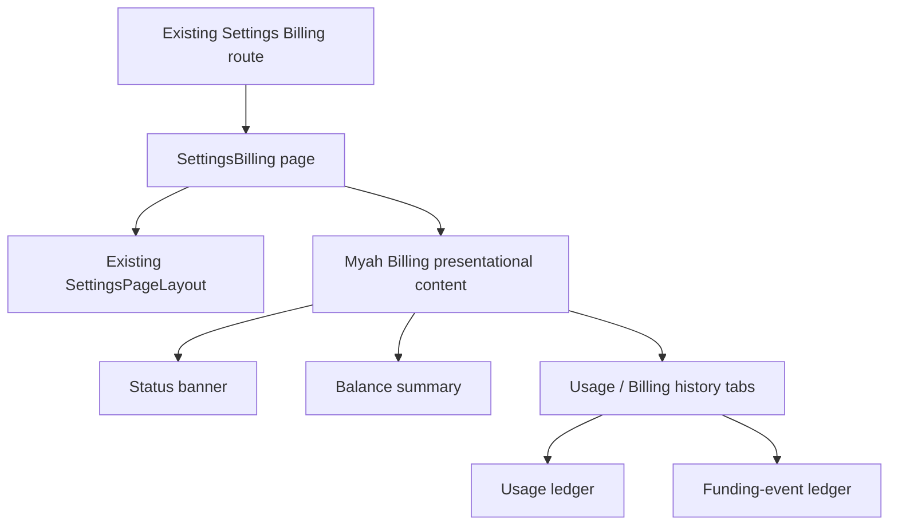

# Workspace Admin Billing and Usage Page

**Status:** Approved design  
**Linear owner:** [MYAH-150 — Add minimal admin usage/billing screen or settings panel](https://linear.app/t3labs/issue/MYAH-150/add-minimal-admin-usagebilling-screen-or-settings-panel)  
**Project / milestone:** myah / Stage 1 — Ready for paid design partners  
**Canonical branch:** `daryll/myah-150-add-minimal-admin-usagebilling-screen-or-settings-panel`

## 1. Decision summary

MYAH-150 adds a workspace-admin Billing page to the existing Twenty Settings experience. It is a frontend-only design and implementation issue.

The page will:

- remain at the existing `SettingsPath.Billing` route;
- remain protected by the existing `PermissionFlagType.WORKSPACE` settings guard;
- appear as a direct item in the existing Workspace navigation section, immediately after General;
- preserve the current Settings sidebar, header, breadcrumbs, themes, spacing, responsive behavior, and visual language;
- show an available US-dollar balance with a secondary sponsored/purchased breakdown;
- show month-to-date settled spend and managed-operation count;
- keep the balance summary visible above Usage history and Billing history tabs;
- show customer-facing usage rows rather than provider internals;
- show funding events, receipts, and invoices in Billing history;
- render a disabled **Add funds** action with persistent “Online top-ups coming soon” guidance;
- represent healthy, low-balance, empty/blocked, loading, empty-history, unavailable, and not-connected states;
- use realistic Storybook fixtures for populated states while rendering no fabricated financial data in production.

MYAH-150 will not add a billing read API, Metronome query resolver, Stripe checkout, Stripe Customer Portal, payment webhooks, invoice generation, or live top-up behavior.

## 2. Problem explained plainly

Workspace administrators need one place to answer three questions:

1. How much money can this workspace currently spend on Myah-managed services?
2. Which workspace activities consumed that balance?
3. Which funding events, receipts, or invoices changed the balance?

The current Twenty frontend has a subscription-oriented Billing screen and generic credit-usage analytics. Those surfaces do not represent Myah's managed-provider prepaid dollar balance:

- Metronome owns Myah prepaid commitments, sponsored funding, Stripe-funded commitments, invoices, and billing history.
- Myah's managed-provider operation journal owns temporary reservations, customer-price quotes, operation outcomes, and settlement state.
- Twenty subscription credits and seat-plan data are a separate billing model and must not be shown as Myah prepaid funds.

The repository currently has no customer-facing GraphQL or REST API for the Metronome prepaid balance or the managed-provider operation journal. A frontend-only page therefore cannot honestly show live values. This design keeps the production page explicit about that limitation and makes the presentation contract ready for a later read-only data issue.

## 3. Scope boundary

### 3.1 In scope

- Existing Settings navigation item order and visibility.
- Existing Billing route content.
- Billing page layout and reusable presentational view model.
- Balance, month-to-date spend, usage ledger, and billing-history ledger presentation.
- Disabled future top-up action.
- Loading, unavailable, healthy, warning, blocked, and empty states.
- Storybook fixtures and interactions for all approved visual states.
- Focused navigation behavior tests.
- Browser verification in the existing Settings shell.

### 3.2 Out of scope

- New server resolver, controller, database query, or generated GraphQL type.
- Metronome balance, invoice, or usage-history reads.
- Stripe checkout, payment methods, portal sessions, webhooks, refunds, receipts, or invoice creation.
- Automatic recharge, top-up amounts, payment forms, taxes, or currencies other than USD.
- Pricing, plans, subscriptions, seat billing, trials, or entitlement management.
- Charts, exports, search, custom date ranges, advanced filters, or per-user detail routes.
- Provider cost, gross margin, raw operation IDs, provider configuration, model IDs, token counts, or reconciliation internals.
- A new Settings shell, sidebar, navigation group, route family, global state store, or feature flag.
- Deletion or refactoring of unrelated Twenty subscription-billing components.

## 4. Existing Settings integration

The page is a small extension of the existing Settings experience, not a standalone dashboard.

### 4.1 Navigation

Within the existing Workspace section, the intended order begins:

1. General
2. Billing
3. Data model
4. Layout
5. Members
6. remaining existing items in their existing order

Only the existing Billing item's position and visibility change. No unrelated item is renamed, regrouped, restyled, hidden, or made visible.

The Billing item is visible when the member has `PermissionFlagType.WORKSPACE`. It no longer depends on Twenty's native `billing.isBillingEnabled` client setting because Myah billing remains relevant when Twenty subscription billing is disabled.

### 4.2 Route

The existing `SettingsPath.Billing` route and its existing `SettingsProtectedRouteWrapper` remain authoritative. `SettingsRoutes.tsx` requires no new route.

The route performs a clean Myah cutover: it renders the approved Myah balance-and-ledger page rather than the old seat/subscription page. The old Twenty billing components remain in the repository and are not broadly deleted or refactored by this issue.

### 4.3 Settings shell

The implementation must reuse existing Settings layout primitives and preserve:

- the current sidebar component;
- the current close/header treatment;
- Workspace / Billing breadcrumbs;
- dark and light theme behavior;
- content width and spacing conventions;
- current responsive breakpoints;
- existing navigation icons and interaction behavior except for the Billing item placement.

MYAH-150 must not introduce Myah-specific Settings chrome or branding.

## 5. Information architecture

The page has two persistent summary cards followed by two local ledger tabs.

### 5.1 Available balance card

The primary card shows:

- **Available balance** as a formatted US-dollar amount;
- sponsored and purchased amounts as secondary detail when known;
- a disabled **Add funds** button;
- visible text: **Online top-ups coming soon**.

The available balance is the primary number. Sponsored and purchased amounts are a breakdown of one spendable balance, not separate wallets.

### 5.2 Month-to-date spend card

The secondary card shows:

- settled customer spend for the current calendar month;
- settled managed-operation count;
- the date range represented.

Temporary reservations and unsettled operations do not contribute to this total.

### 5.3 Usage history tab

Usage history is active by default. It shows one customer-facing row per managed operation with:

- date and time;
- friendly activity name;
- workspace member;
- customer-facing billing status;
- customer charge.

The initial period control offers 7, 30, and 90 days and defaults to 30 days. Arbitrary date ranges are deferred.

### 5.4 Billing history tab

Billing history contains funding events only:

- purchased top-ups;
- sponsored funding grants;
- refunds;
- balance adjustments or reversals;
- a receipt or invoice link when one exists.

Usage charges do not repeat in Billing history. The signed amount describes the event's effect on workspace balance.

## 6. Money and terminology

The customer model is an ordinary prepaid US-dollar balance.

- Do not call the primary amount “credits.”
- Store view-model monetary values as integer cents.
- Format cents with `Intl.NumberFormat` as USD.
- Never calculate or persist money using floating-point dollar values.
- Never show Twenty subscription credits as Myah prepaid balance.
- Never expose provider cost or margin data.

A loaded example may carry `availableBalanceCents: 4280` and render `$42.80`.

## 7. Customer-facing status mapping

Internal operation lifecycle values are translated into stable customer language.

| Customer label | Meaning | Amount display |
| --- | --- | --- |
| Settled | Final customer charge confirmed | Final dollar amount |
| Processing | Reserved, pending delivery, or awaiting settlement | Pending |
| Not charged | Reservation released after a non-billable outcome | $0.00 |
| Under review | Reconciliation is required | Pending |

Only Settled rows contribute to month-to-date spend.

The frontend must not expose internal state names, delivery attempts, error codes, provider receipts, or reconciliation details.

## 8. Page states

### 8.1 Healthy

- No alert banner.
- Balance, spend, and histories render normally.

### 8.2 Low balance

- A compact warning banner appears above the summary cards.
- Copy explains that managed services may pause soon.
- Balance and histories remain available.

The frontend does not calculate a low-balance threshold. A later read contract supplies the status.

### 8.3 Empty or blocked

- A danger banner explains that managed services are paused.
- Available balance renders `$0.00` only when a real loaded state explicitly supplies zero.
- **Add funds** remains disabled in MYAH-150.

### 8.4 No usage or no billing history

- Summary cards remain visible.
- The affected tab shows a native empty state with explanatory copy.
- The other tab remains independently usable.

### 8.5 Loading

- Existing Twenty skeleton patterns render.
- `$0.00` is never used as a loading placeholder.

### 8.6 Not connected

This is the initial production state for MYAH-150.

- An informational banner states that live billing information has not been connected.
- Unknown monetary values render as `—`, not `$0.00`.
- Usage and Billing history explain that live records are unavailable.
- **Add funds** remains disabled with its persistent coming-soon explanation.
- No Storybook fixture data is imported into production code.

### 8.7 Future load failure

The presentational contract supports an unavailable/error state without stale or fabricated values. A retry action is deferred until a real request exists.

## 9. Interaction behavior

- Usage history is the default active tab.
- Tab changes remain on `SettingsPath.Billing`; no subroutes are introduced.
- The active tab and selected period are local component state only.
- Changing a period updates selection state. MYAH-150 does not simulate a server query in production.
- Storybook fixtures may demonstrate the intended filtered result.
- Document actions use specific labels such as **View receipt from July 1, 2026**.
- **Add funds** has no click handler in MYAH-150.

## 10. Component and data architecture

### 10.1 Page responsibility

The `SettingsBilling` page:

- uses the existing settings layout and breadcrumbs;
- supplies the initial not-connected state;
- performs no network request;
- contains no fixture money or history.

### 10.2 Presentational responsibility

The Billing content accepts a typed view model and renders:

- loading;
- not connected or unavailable;
- ready with `healthy`, `low`, or `empty` balance status;
- populated and empty ledgers.

A discriminated union uses a `state` field to ensure that loaded financial fields exist only in a loaded state.

The view-model types remain close to the Billing component. MYAH-150 does not add a new shared package, global atom, GraphQL model, or speculative service layer.

### 10.3 Future connection points

A later read-only billing issue will:

1. fetch Metronome-owned balance and funding history through a server-controlled API;
2. query workspace-scoped managed-provider operation history;
3. map both sources into the approved frontend view model;
4. preserve the presentation component unchanged.

A later Stripe issue will:

1. enable the existing **Add funds** action;
2. connect Stripe-funded Metronome commitments;
3. populate receipt or invoice document links;
4. preserve the approved page hierarchy.

## 11. Accessibility and responsive behavior

### 11.1 Accessibility

- Reuse existing Twenty tab, banner, button, empty-state, skeleton, and table primitives where available.
- Tabs support keyboard navigation and expose selected state.
- Status meaning is always written in text and is never color-only.
- The disabled **Add funds** control has persistent adjacent explanatory text rather than tooltip-only guidance.
- Tables use semantic headers.
- Document links include the record type and date in their accessible name.
- Loading, empty, unavailable, and blocked states remain distinguishable to assistive technology.

### 11.2 Responsive behavior

- Preserve the existing Settings shell and breakpoints.
- Summary cards stack at narrower content widths.
- Usage rows always retain Date, Activity, and Amount.
- Member and Status may move into a secondary stacked line using an existing Twenty responsive-table pattern.
- Do not change sidebar collapse, drawer, or mobile navigation behavior.

## 12. Security and privacy

The page is workspace-scoped and workspace-admin-only through the existing permission guard.

The frontend must not receive or render:

- Metronome customer IDs;
- Stripe customer, payment-intent, or session IDs;
- provider credentials;
- authorization headers;
- provider cost or margin;
- raw provider prompts or responses;
- internal reconciliation errors or delivery receipts.

Storybook fixtures use invented people, amounts, dates, and document URLs. They contain no production identifiers or payment data.

## 13. Alternatives considered

### A. Single long page

Rejected. Keeping both ledgers expanded makes the page unnecessarily long as history grows.

### B. Persistent balance with Usage and Billing history tabs

Selected. It keeps the most important number visible while containing dense history tables behind one local switch.

### C. Separate Overview, Usage, and Billing history routes

Rejected. It adds navigation and repeats summary content before the initial scope needs separate screens.

### D. Custom Myah Settings shell

Rejected. It duplicates Twenty's established navigation, layout, theme, and responsive behavior and conflicts with the requirement to change only the Billing page.

### E. New Myah billing route

Rejected. The existing Billing route, navigation label, and permission guard already represent the correct customer concept.

### F. Add a managed-billing client configuration flag

Rejected for MYAH-150. It expands a frontend-only UI issue into server configuration and generated client state solely to preserve two route implementations.

### G. Reuse Twenty subscription credits and billing APIs

Rejected. Those values represent a different billing model and could mislead customers about their Myah prepaid dollar balance.

### H. Add a live read-only billing API now

Rejected for MYAH-150. It would make this a frontend-plus-backend issue. The approved presentation contract keeps that later integration narrow and explicit.

## 14. Verification design

### 14.1 Focused navigation test

Extend the existing `useSettingsNavigationItems` test to prove:

- Billing is visible when `PermissionFlagType.WORKSPACE` is granted even if Twenty billing is disabled or not loaded;
- Billing is hidden without `PermissionFlagType.WORKSPACE`;
- Billing immediately follows General;
- unrelated navigation behavior remains unchanged.

### 14.2 Storybook states and interactions

Extend the existing Billing story with:

- initial production/not-connected;
- healthy funded workspace;
- mixed sponsored and purchased funds;
- low balance;
- empty/blocked balance;
- no usage;
- no Billing history.

Storybook interactions prove:

- Usage history is active initially;
- Billing history can be selected;
- 30 days is selected initially and another preset can be chosen;
- **Add funds** is disabled and its explanatory text is visible;
- not-connected state contains no fabricated `$0.00`;
- approved status and empty-state copy renders.

### 14.3 Browser smoke verification

Inspect the page in a real browser and record visual evidence for:

- Billing immediately after General in the unchanged Settings sidebar;
- healthy, low, blocked, empty, and not-connected states;
- Usage and Billing history tabs;
- dark and light themes;
- desktop and narrow content widths;
- no clipped money, lost Activity or Amount fields, broken focus, or accidental overflow.

### 14.4 Repository checks

Run on the approved Linux host with the repository's pinned Node runtime:

- the focused navigation-hook test;
- the supported focused Storybook test or build target;
- `yarn nx typecheck twenty-front`;
- changed-file formatting with pinned oxfmt;
- applicable changed-file lint with Oxlint.

A backend test, database migration, generated GraphQL update, Stripe test, or full E2E run is not required because MYAH-150 changes no corresponding contract or shared E2E infrastructure.

## 15. Acceptance criteria

MYAH-150 is complete only when:

1. Workspace members with the existing Workspace settings permission see Billing immediately after General.
2. Members without that permission do not see or access the page.
3. The page uses the existing Billing path and existing Settings shell.
4. No unrelated Settings navigation or layout behavior changes.
5. The approved persistent balance plus two-ledger-tab layout is implemented.
6. Money is displayed in USD from integer-cent view-model values.
7. The primary balance supports a secondary sponsored/purchased breakdown.
8. **Add funds** is disabled with persistent coming-soon guidance.
9. Usage rows contain only approved customer-facing fields and statuses.
10. Billing history contains funding events and optional receipt/invoice links, not usage charges.
11. Healthy, low, empty/blocked, loading, empty-history, unavailable, and not-connected states are represented.
12. Production renders no fixture financial data and does not misrepresent unknown values as zero.
13. Storybook contains realistic isolated fixtures for the approved populated states.
14. Focused navigation, Storybook, typecheck, format, lint, and browser verification pass or any unrelated pre-existing limitation is reported precisely.
15. Deferred backend and Stripe scope remains unimplemented and explicitly recorded in delivery notes.

## 16. Deferred follow-up scope

Separate later issues must own:

- a workspace-admin read API for current Metronome balance and funding history;
- a workspace-scoped read API for managed-provider operation history;
- server-side authorization and pagination for those APIs;
- Stripe-funded top-up checkout and payment confirmation;
- receipts, invoices, refunds, and document links;
- low-balance thresholds, alerts, and automatic recharge;
- data-backed period filtering, search, export, and custom date ranges.
